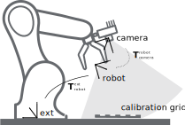
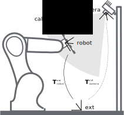

# Hand-Eye Calibration




 Left image: __eye-in-hand__. To find the `T_robot_camera`. Right image: __eye-to-hand__. To find the `T_ext_camera`.
[Source](https://doc.rc-visard.com/latest/en/handeye_calibration.html)


### Index:
- [Problem](https://github.com/cvg25/hand-eye_calibration#problem)
- [Motivation](https://github.com/cvg25/hand-eye_calibration#motivation)
- [Proposed solution explained](https://github.com/cvg25/hand-eye_calibration#proposed-solution-explained)
- [How to use](https://github.com/cvg25/hand-eye_calibration#how-to-use)
- [Advantages](https://github.com/cvg25/hand-eye_calibration#advantages)
- [Limitations](https://github.com/cvg25/hand-eye_calibration#limitations)
- [Hardware](https://github.com/cvg25/hand-eye_calibration#hardware)
- [Acknowledgments](https://github.com/cvg25/hand-eye_calibration#acknowledgments)

### Problem:
"In robotics and mathematics, the hand eye calibration problem (also called the robot-sensor or robot-world calibration problem) is the problem of determining the transformation between a robot end-effector and a camera or between a robot base and the world coordinate system." [Learn more.](https://en.wikipedia.org/wiki/Hand_eye_calibration_problem)

### Motivation:
To develop a calibration procedure that:
- It is __end to end__. No human intervention once the system is ready to start the calibration process.
- It is suitable for both cases, __eye-in-hand__ (camera mounted on the robot) and __eye-to-hand__ (camera fixed to the workspace).
- __It optimizes for depth and rgb channels at the same time.__
- It is easily parameterized by a .json file to fit any posible configuration without need of code editing.
- It is fast and easy compared to other more manual or different steps solutions.
- It uses common python libraries.

### Proposed solution explained:
The calibration process estimates the camera extrinsics with respect to:
- Robot base coordinates for the __eye-to_hand__.
- Tool Center Position coordinates for the __eye-in-hand__.

During the calibration, the robot moves to a predefined set of 3D locations. At each 3D location the camera detects the center point of the checkerboard pattern, and it stores both: the position of the robot with respect to the base and the position of the center point detected with respect to the center of the camera.

The 3D position of a pixel seen in an rgbd image can be computed as:
```
point_z = camera_depth_img[checkerboard_center_pix[1]][checkerboard_center_pix[0]]
point_x = np.multiply(checkerboard_center_pix[0]-camera.intrinsics[0][2], point_z/camera.intrinsics[0][0])
point_y = np.multiply(checkerboard_center_pix[1]-camera.intrinsics[1][2], point_z/camera.intrinsics[1][1])
```  
Where `camera.instrisics` is the intrisics matrix of the camera:
```
camera.instrics = [[fx, 0, ox],
                   [0, fy, oy],
                   [0,  0,  1]] # f = focal distance, o = offset from origin.
```
The result of visiting all 3D locations is two datasets of equivalent points but in different coordinate systems. To find the optimal rigid transformation matrix between those two datasets, the following steps are executed:
1. Find the centroids of both dataset.
2. Bring both dataset to the origin then find the optimal rotation R.
3. Find the traslation t.

```
def get_rigid_transform(A, B):
    assert len(A) == len(B)
    N = A.shape[0]; # Total points
    centroid_A = np.mean(A, axis=0) #  Find centroids
    centroid_B = np.mean(B, axis=0)
    AA = A - np.tile(centroid_A, (N, 1)) # Centre the points
    BB = B - np.tile(centroid_B, (N, 1))
    H = np.dot(np.transpose(AA), BB) # Dot is matrix multiplication for array
    U, S, Vt = np.linalg.svd(H) # Find the rotation matrix R
    R = np.dot(Vt.T, U.T)
    if np.linalg.det(R) < 0: # Special reflection case
       Vt[2,:] *= -1
       R = np.dot(Vt.T, U.T)
    t = np.dot(-R, centroid_A.T) + centroid_B.T # Find the traslation t
    return R, t
```
Visit this post by [nghiaho.com](http://nghiaho.com/?page_id=671) to learn more as it is the original source of inspiration. The implementation of only the __hand-to-eye__ case was first seen on [github.com/andyzeng/visual-pushing-grasping](https://github.com/andyzeng/visual-pushing-grasping).

### How to use:
1. Put the checkerboard pattern fixed to either the robot hand tool center position (eye-in-hand calibration) or the workspace (eye-to-hand). Make sure it will not move during the calibration process.

2. Go to `hand-eye_calibration/rs_server/` and compile `rs_server.cpp`. Make sure you have the [librealsense SDK](https://github.com/IntelRealSense/librealsense/) installed.
```
$ cd hand-eye_calibration/rs_server/
$ make
```
3. Connect realsense to the computer using a USB3.0 interface connection.
4. Start RealSense TCP streaming server and indicate the `PORT`:
```
$ ./rs_streamer
```
Keep it running while calibrating, each time the robot connects to retrieve an RGBD frame it will output `Connected to client.` on the terminal. To further test a python TCP client that fetches RGBD frames from the server edit the `configurations/camera_config.json` (see next step for details) and then run: `$ python camera_streamer.py`

5. Create a brand new conda environment and run: `$ pip install -r requirements.txt` in order to install all the python libraries needed at the versions tested.

6. Open the `configurations/calibrate_config.json` file and fill in the parameters:
  - __calibration_type__:
    - "MOVING_CAMERA": the camera mounted on the robot. (eye-in-hand)
    - "FIXED_CAMERA": the camera is fixed to the workspace and independent of robot moves. (eye-to-hand)
  - __calib_grid_step__: it defines the step distance in meters between "photo positions". (e.g. 0.05 meters)
  - __workspace_limits__: it is a cube defined by 3 points (X,Y,Z) from the robots' base. Inside this cube the robot will move to the different "photo positions" parameterized by __calib_grid_step__ to capture a data point. It is important to take into account that the closest distance from the camera to the checkerboard is higher than the minZ value of the depth channel. Note: on RealSense D415, minZ is 0.5 meters. shape = (3,2). rows = X, Y, Z. colums = MIN, MAX values.
  - __reference_point_offset__: it is the point (X,Y,Z) position of the center of the checkerboard pattern with respect to the robots' base.
  - __tool_orientation__: it is the orientation of the robot TCP in the robots' base system for every "photo position".
  - __checkerboard_size__: the size of the checkerboard. E.g. a checkerboard of 4x4 black-white squares is of size 3 as that is the number of inner crosses.
  - __camera_config_file__: the configuration file for the camera. Example at: `configurations/camera_config.json`
    - Should edit:
      - __tcp_host_ip__: IP Address of the rs_streamer TCP server.  
      - __tcp_port__: PORT of the rs_streamer TCP server.
    - Might edit: If you change the parameters (im_height, im_width, buffer_size), you should also edit the rs_server to match.
  - __robot_config_file__: the configuration file for the UR Robot. Example at: `configurations/robot_config.json`
    - Should edit:
      - __robot_ip__: IP Address of the robot.
      - __program__: path to program that should be loaded on the robot, which includes its installation: tcp configuration, center of gravity... etc.
      - __home_joints_rad__: robot home pose. In radians for each of its joints.
    - Might need to edit:
      - __tcp_port__: TCP Port connection of the robot.
      - __rtc_port__: RTC Port connection of the robot.
      - __dashboard_port__: Dashboard
    - Edit at your own risk: the rest of parameters regarding velocities and accelerations have been tested for UR robots to perform the calibration under safety conditions. Changing those might speed up the process but also suffer from bad image captures due to sharp motions, affecting the precision of the calibration result.

7. Open a different terminal and execute `$ python calibrate.py` to move the robot and calibrate. Note: the robot will move inside the 3D cube grid indicated by workspace_limits with a step size of calib_grid_step at the config.json file. Be cautious.

8. Once the calibration process ends, two files will be stored in `hand-eye_calibration/calibrations/`:
 - `DATETIME_camera_pose.txt`: it contains the transformation matrix between the robot and the camera.
 - `DATETIME_camera_depth_offset.txt`: it contains a value which is a scale factor that should be multiplied with each pixel captured from the camera. Note: as tested RealSense D415 series are not likely to suffer a scaling problem, but other devices might.

9. To test the result of the calibrated camera extrinsics edit the `configurations/touch_tester_config.json` file to meet your setup and execute `$ python touch_tester.py`. It provides a UI where the user can click at any point in the RGBD image and the robot moves its end-effector to the 3D location of that point.

### Advantages:
- It directly optimizes for both depth and rgb channels at the same time. This has many advantages. For example, it introduces the noise of the depth sensor in the calibration process and calculates the transformation matrix with it. As opposed to other solutions where the calibration process is only estimated using the rgb channels and a reference point (e.g. ArUco marker) which its depth precision differs from the depth channel of the image, therefore not capturing this discrepancies inside the calibration process.
- It is fast and easy compared to other more manual or different steps solutions.
- It uses common python libraries.
- It is suitable for both cases, __eye-in-hand__ (camera mounted on the robot) and __eye-to-hand__ (camera fixed to the workspace).
- It is __end to end__. No human intervention once the system is ready to start the calibration process.

### Limitations:
- Precision increases with samples. As the robot has to move to different photo positions, it is sometimes difficult to use in very small spaces or with obstacles.
- It is only suitable for RGBD Cameras.

### Hardware:

- RGBD Camera, Robot and PC.

 #### Tested on:
  - RGBD Camera: Intel RealSense D415
  - Robot: UR10e
  - PC: Ubuntu 18 running Python 3.8

### Acknowledgments

  This calibration software was performed at INESCOP Footwear Technological Institute (https://www.inescop.es) to calibrate the cameras for the [SoftManBot H2020](http://softmanbot.eu/) project. Polígono Industrial Campo Alto, Elda, Alicante (Spain).

  Method and source code inspired by:

  https://github.com/IntelRealSense/librealsense

  https://github.com/andyzeng/visual-pushing-grasping

  https://github.com/hengguan/Hand-Eye-Calibration-Matlab

  https://github.com/nghiaho12/rigid_transform_3D
